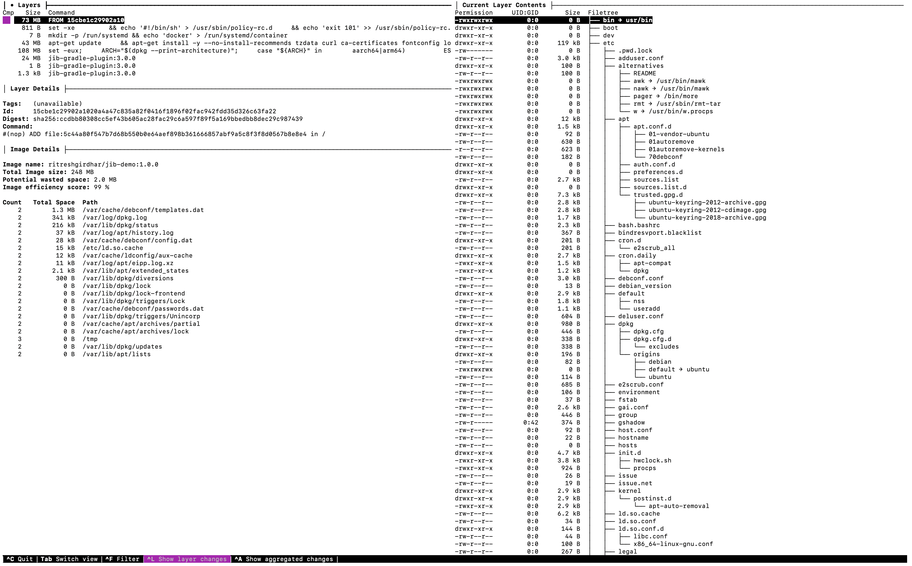

# Containerization and its methods : 

# What is Containerization ? 


# Why JIB ?


### Native Approach 


### JIB Flow


https://dzone.com/articles/containerizing-springboot-application-with-jib
https://cloud.google.com/blog/products/application-development/introducing-jib-build-java-docker-images-better

### Build image with Gradle JIB plugin

Note: It requires gradle version 5.1. If your version is less than 5.1, please run `gradle wrapper --gradle-version=5.1` first.

```
$ cd demo/
```
#### Run gradle task `jibDockerBuild`
```
$ ./gradlew jibDockerBuild

> Task :jibDockerBuild
Tagging image with generated image reference demo:0.0.1-SNAPSHOT. If you'd like to specify a different tag, you can set the jib.to.image parameter in your build.gradle, or use the --image=<MY IMAGE> commandline flag.

Containerizing application to Docker daemon as demo:0.0.1-SNAPSHOT...
Base image 'adoptopenjdk:8-jre' does not use a specific image digest - build may not be reproducible
The base image requires auth. Trying again for adoptopenjdk:8-jre...
Using base image with digest: sha256:5b55ef54f25717b7680db93625a6969d52d5608a0d7984f007ad291b82d531e8

Container entrypoint set to [java, -cp, /app/resources:/app/classes:/app/libs/*, com.example.demo.DemoApplication]

Built image to Docker daemon as demo:0.0.1-SNAPSHOT
Executing tasks:
[==============================] 100.0% complete
BUILD SUCCESSFUL in 8s
3 actionable tasks: 3 executed
```

#### Let's dive into docker image and check layers.
``` 
$ dive demo:0.0.1-SNAPSHOT
Image Source: docker://demo:0.0.1-SNAPSHOT
Fetching image... (this can take a while for large images)
Analyzing image...
Building cache... 
```


#### Run docker image
``` 
$ docker run -p8080:8080 demo:0.0.1-SNAPSHOT

  .   ____          _            __ _ _
 /\\ / ___'_ __ _ _(_)_ __  __ _ \ \ \ \
( ( )\___ | '_ | '_| | '_ \/ _` | \ \ \ \
 \\/  ___)| |_)| | | | | || (_| |  ) ) ) )
  '  |____| .__|_| |_|_| |_\__, | / / / /
 =========|_|==============|___/=/_/_/_/
 :: Spring Boot ::                (v2.5.0)

2021-05-29 19:22:47.194  INFO 1 --- [           main] com.example.demo.DemoApplication         : Starting DemoApplication using Java 1.8.0_292 on e9584e181be5 with PID 1 (/app/classes started by root in /)
2021-05-29 19:22:47.199  INFO 1 --- [           main] com.example.demo.DemoApplication         : No active profile set, falling back to default profiles: default
2021-05-29 19:22:48.649  INFO 1 --- [           main] o.s.b.w.embedded.tomcat.TomcatWebServer  : Tomcat initialized with port(s): 8080 (http)
2021-05-29 19:22:48.671  INFO 1 --- [           main] o.apache.catalina.core.StandardService   : Starting service [Tomcat]
2021-05-29 19:22:48.671  INFO 1 --- [           main] org.apache.catalina.core.StandardEngine  : Starting Servlet engine: [Apache Tomcat/9.0.46]
2021-05-29 19:22:48.836  INFO 1 --- [           main] o.a.c.c.C.[Tomcat].[localhost].[/]       : Initializing Spring embedded WebApplicationContext
2021-05-29 19:22:48.836  INFO 1 --- [           main] w.s.c.ServletWebServerApplicationContext : Root WebApplicationContext: initialization completed in 1552 ms
2021-05-29 19:22:49.406  INFO 1 --- [           main] o.s.b.w.embedded.tomcat.TomcatWebServer  : Tomcat started on port(s): 8080 (http) with context path ''
2021-05-29 19:22:49.422  INFO 1 --- [           main] com.example.demo.DemoApplication         : Started DemoApplication in 2.888 seconds (JVM running for 3.518)
2021-05-29 19:22:49.425  INFO 1 --- [           main] o.s.b.a.ApplicationAvailabilityBean      : Application availability state LivenessState changed to CORRECT
2021-05-29 19:22:49.428  INFO 1 --- [           main] o.s.b.a.ApplicationAvailabilityBean      : Application availability state ReadinessState changed to ACCEPTING_TRAFFIC
2021-05-29 19:23:04.809  INFO 1 --- [nio-8080-exec-1] o.a.c.c.C.[Tomcat].[localhost].[/]       : Initializing Spring DispatcherServlet 'dispatcherServlet'
2021-05-29 19:23:04.809  INFO 1 --- [nio-8080-exec-1] o.s.web.servlet.DispatcherServlet        : Initializing Servlet 'dispatcherServlet'
2021-05-29 19:23:04.810  INFO 1 --- [nio-8080-exec-1] o.s.web.servlet.DispatcherServlet        : Completed initialization in 1 ms
```

Happy learning !