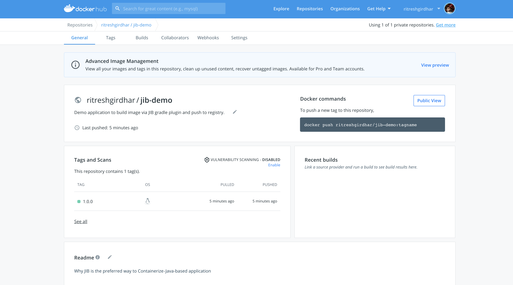

# Containerization and its methods : 

## What is Containerization?
Containerization is the process of packaging software code, its required dependencies, configurations, and other detail to be easily deployed in the same or another computing environment.
containerization is the encapsulation of an application and its required environment.
To package up apps so they could be run on production systems. To do this we need some kind of virtualization layer that would allow anything to be run. Heroku was one of the first to tackle this and they used a Linux virtualization system called "lxc" - short for Linux Containers.
A bit later a Heroku competitor named dotCloud was trying to tackle similar problems and went a different route which ultimately led to Docker, a standard way to create and run containers across platforms including Windows, Mac, Linux, Kubernetes.

## Ways to achieve Containerization?
* Dockerfile
* Buildpacks
* JIB

## Why JIB?

* Simple - As developer need not maintain Dockerfile and all ways to handle it. Dev could focus majorly on the application functionality and the Gradle/Maven Jib plugin will do the rest. Actually, we don't even have to have docker installed to create and publish the docker images ourselves.
* Fast - As JIB takes advantage of caching image layers. Deploy your changes fast. Jib separates your application into multiple layers, splitting dependencies from classes. Now you don't have to wait for Docker to rebuild your entire Java application - just deploy the layers that changed.
* Reproducible - Rebuilding your container image with the same contents always generates the same image. Never trigger an unnecessary update again.

### Native Approach 


### JIB Flow


### Build image with Gradle JIB plugin

Note: It requires gradle version 5.1. If your version is less than 5.1, please run `gradle wrapper --gradle-version=5.1` first.

#### Run gradle task `jibDockerBuild`
```
$ cd demo/
$ ./gradlew jib

> Task :jib

Containerizing application to ritreshgirdhar/jib-demo:1.0.0...
Base image 'adoptopenjdk:8-jre' does not use a specific image digest - build may not be reproducible
Using credentials from Docker config (/Users/ritgirdh/.docker/config.json) for ritreshgirdhar/jib-demo:1.0.0
The base image requires auth. Trying again for adoptopenjdk:8-jre...
Using credentials from Docker config (/Users/ritgirdh/.docker/config.json) for adoptopenjdk:8-jre
Using base image with digest: sha256:5b55ef54f25717b7680db93625a6969d52d5608a0d7984f007ad291b82d531e8

Container entrypoint set to [java, -cp, /app/resources:/app/classes:/app/libs/*, com.example.demo.DemoApplication]

Built and pushed image as ritreshgirdhar/jib-demo:1.0.0
Executing tasks:
[============================  ] 91.7% complete
> launching layer pushers

BUILD SUCCESSFUL in 11s
```

#### Let's dive into docker image and check layers.
``` 
$ dive ritreshgirdhar/jib-demo:1.0.0
Image Source: docker://ritreshgirdhar/jib-demo:1.0.0
Fetching image... (this can take a while for large images)
Analyzing image...
Building cache... 
```


#### Check docker image on docker hub 


#### Check docker image on local 
``` 
$ docker images
REPOSITORY          TAG                 IMAGE ID            CREATED             SIZE
```

You will not find docker image. As, JIB directly push the image to the registry. It doesn't require docker to be installed on the developer machine
unlike native containerization approach. Isn't it cool!

#### Let's Pull docker image
```
$ docker pull ritreshgirdhar/jib-demo:1.0.0
1.0.0: Pulling from ritreshgirdhar/jib-demo
345e3491a907: Pull complete 
57671312ef6f: Pull complete 
5e9250ddb7d0: Pull complete 
592ec2d7c137: Pull complete 
be75864d3169: Pull complete 
5bd29a5522bd: Pull complete 
db04461d3510: Pull complete 
305a053a7af7: Pull complete 
Digest: sha256:331a5a98492365fa98079ff1d2b615ddd4cb578a9b290ca5ac09f6bfd3ffff80
Status: Downloaded newer image for ritreshgirdhar/jib-demo:1.0.0
docker.io/ritreshgirdhar/jib-demo:1.0.0
```

#### Let's run docker image 
``` 
$ docker run -p8080:8080 ritreshgirdhar/jib-demo:1.0.0

  .   ____          _            __ _ _
 /\\ / ___'_ __ _ _(_)_ __  __ _ \ \ \ \
( ( )\___ | '_ | '_| | '_ \/ _` | \ \ \ \
 \\/  ___)| |_)| | | | | || (_| |  ) ) ) )
  '  |____| .__|_| |_|_| |_\__, | / / / /
 =========|_|==============|___/=/_/_/_/
 :: Spring Boot ::                (v2.5.0)

2021-05-30 09:07:19.586  INFO 1 --- [           main] com.example.demo.DemoApplication         : Starting DemoApplication using Java 1.8.0_292 on 100c84485a32 with PID 1 (/app/classes started by root in /)
2021-05-30 09:07:19.592  INFO 1 --- [           main] com.example.demo.DemoApplication         : No active profile set, falling back to default profiles: default
2021-05-30 09:07:21.637  INFO 1 --- [           main] o.s.b.w.embedded.tomcat.TomcatWebServer  : Tomcat initialized with port(s): 8080 (http)
2021-05-30 09:07:21.665  INFO 1 --- [           main] o.apache.catalina.core.StandardService   : Starting service [Tomcat]
2021-05-30 09:07:21.665  INFO 1 --- [           main] org.apache.catalina.core.StandardEngine  : Starting Servlet engine: [Apache Tomcat/9.0.46]
2021-05-30 09:07:21.795  INFO 1 --- [           main] o.a.c.c.C.[Tomcat].[localhost].[/]       : Initializing Spring embedded WebApplicationContext
2021-05-30 09:07:21.796  INFO 1 --- [           main] w.s.c.ServletWebServerApplicationContext : Root WebApplicationContext: initialization completed in 2093 ms
2021-05-30 09:07:22.348  INFO 1 --- [           main] o.s.b.w.embedded.tomcat.TomcatWebServer  : Tomcat started on port(s): 8080 (http) with context path ''
2021-05-30 09:07:22.364  INFO 1 --- [           main] com.example.demo.DemoApplication         : Started DemoApplication in 3.475 seconds (JVM running for 4.111)
2021-05-30 09:07:22.367  INFO 1 --- [           main] o.s.b.a.ApplicationAvailabilityBean      : Application availability state LivenessState changed to CORRECT
2021-05-30 09:07:22.370  INFO 1 --- [           main] o.s.b.a.ApplicationAvailabilityBean      : Application availability state ReadinessState changed to ACCEPTING_TRAFFIC
```

#### Test application via CURL command 
``` 
$ curl -i http://localhost:8080/
HTTP/1.1 200 
Content-Type: text/plain;charset=UTF-8
Content-Length: 37
Date: Sun, 30 May 2021 09:14:20 GMT

Welcome to Jib containerization demo 
```
```
$ curl -i http://localhost:8080/hostname
HTTP/1.1 200 
Content-Type: text/plain;charset=UTF-8
Content-Length: 22
Date: Sun, 30 May 2021 09:13:40 GMT

Welcome tof993e5810002
```

Happy learning !